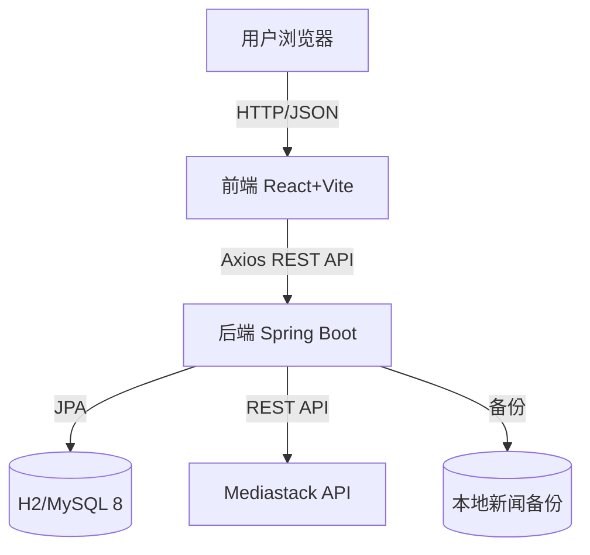

# 微说 (Weishuo) - 现代化微博客平台

微说 (Weishuo) 是一个基于 **Spring Boot** 和 **React + TypeScript** 开发的现代化微博客社交平台。它聚合全球实时新闻资讯,并提供完整的社交互动功能,让用户可以发布动态、浏览新闻、关注热点。

---

## 📚 目录

- [项目概述](#-项目概述)
- [功能特性](#-功能特性)
- [技术栈](#-技术栈)
- [系统架构](#-系统架构)
- [快速开始](#-快速开始)
- [API 接口说明](#-api-接口说明)
- [项目结构](#-项目结构)
- [开发指南](#-开发指南)

---

## 📖 项目概述

**微说** 是一个功能完整的社交平台,用户可以:

1. **📰 浏览资讯**: 实时聚合全球新闻,支持多频道切换
2. **✍️ 发布动态**: 撰写并发布个人微博,支持图文内容
3. **👤 个人主页**: 展示个人信息和发布的动态列表
4. **💬 社交互动**: 点赞、评论、转发等完整社交功能
5. **🔔 消息通知**: 实时通知和私信功能

---

## ✨ 功能特性

### 1. 用户系统
- ✅ 用户注册与登录(邮箱/用户名)
- ✅ 密码加密存储(BCrypt)
- ✅ 个人资料管理(头像、昵称、简介)
- ✅ 个人主页展示

### 2. 内容发布
- ✅ 发布微博动态(最多 500 字)
- ✅ 个人动态列表展示
- ✅ 动态时间线(Timeline)
- 🚧 支持图片上传(开发中)

### 3. 新闻资讯
- ✅ 对接 Mediastack API 获取实时新闻
- ✅ 支持多频道浏览(科技、体育、娱乐等)
- ✅ 新闻详情查看
- ✅ 本地数据备份机制
- ✅ API失败自动切换到数据库备用新闻
- ✅ 应用启动自动初始化20条备用新闻

### 4. 探索功能
- ✅ 热门话题展示(6个分类标签)
- ✅ 话题搜索功能(实时搜索)
- ✅ 话题热度排序(推文数、评论数、点赞数)
- ✅ 随机生成测试话题数据

### 5. 社交功能
- ✅ 关注/粉丝系统(完整实现)
- ✅ 关注/取消关注用户
- ✅ 查看关注列表和粉丝列表
- ✅ 关注状态检查
- ✅ 统计关注数和粉丝数
- 🚧 点赞、评论、转发(UI 已完成,后端开发中)
- 🚧 消息通知(规划中)
- 🚧 私信功能(规划中)

### 5. 用户体验
- ✅ 现代化 UI 设计
- ✅ 响应式布局(移动端适配)
- ✅ 流畅的页面切换
- ✅ 实时数据更新
- ✅ 一键启动脚本(Windows PowerShell)

---

## 🛠 技术栈

### 后端 (Backend)
- **语言**: Java 17+
- **框架**: Spring Boot 3.4.1
- **数据库**: H2 (开发) / MySQL 8 (生产)
- **ORM**: Spring Data JPA + Hibernate
- **安全**: BCrypt 密码加密
- **构建工具**: Maven
- **API集成**: Mediastack 新闻API

### 前端 (Frontend)
- **框架**: React 19.2
- **语言**: TypeScript 5.9
- **路由**: React Router 7.10
- **HTTP**: Axios 1.13
- **图标**: Lucide React
- **构建工具**: Vite 7.2
- **代码规范**: ESLint + TypeScript ESLint

### 数据库表结构
- **users**: 用户信息表
- **posts**: 动态/微博表
- **news_backup**: 新闻备份表
- **topics**: 话题表
- **follows**: 关注关系表

### 外部服务
- **新闻源**: [Mediastack API](https://mediastack.com/)

---

## 🏗 系统架构



---

## 🚀 快速开始

### 环境要求
- **JDK 17+**
- **Node.js 16+** 
- **Maven 3.6+** (项目内置 mvnw)

### 方式一: 一键启动(推荐)

在项目根目录执行:

```powershell
# Windows PowerShell
.\start-all.ps1
```

这会自动在两个窗口中启动前后端服务。

### 方式二: 分别启动

**启动后端**:
```bash
# 进入后端目录
cd backend

# 启动 Spring Boot (使用 H2 内存数据库)
./mvnw spring-boot:run

# 或使用 MySQL 数据库
./mvnw spring-boot:run -Dspring-boot.run.profiles=mysql
```

后端运行在: `http://localhost:8081`

**启动前端**:
```bash
# 进入前端目录
cd frontend

# 安装依赖 (首次运行)
npm install

# 启动开发服务器
npm run dev
```

前端运行在: `http://localhost:5173`

### 访问应用

打开浏览器访问: **http://localhost:5173**

---

## 🔌 API 接口说明

### 认证模块

| 方法 | 路径 | 描述 | 请求体 |
|------|------|------|--------|
| POST | `/api/auth/register` | 用户注册 | `{username, displayName, email, password}` |
| POST | `/api/auth/login` | 用户登录 | `{username, password}` |

### 动态模块

| 方法 | 路径 | 描述 | 参数 |
|------|------|------|------|
| POST | `/api/posts` | 发布动态 | `{content, username, displayName, avatarUrl}` |
| GET | `/api/posts` | 获取所有动态 | - |
| GET | `/api/posts?username={username}` | 获取用户动态 | username |

### 新闻模块

| 方法 | 路径 | 描述 | 参数 |
|------|------|------|------|
| GET | `/api/news/latest` | 获取最新新闻 | channel (hot/tech/society/video/headline) |

### 话题模块

| 方法 | 路径 | 描述 | 参数 |
|------|------|------|------|
| GET | `/api/topics/hot` | 获取热门话题 | - |
| GET | `/api/topics/category/{category}` | 按分类获取话题 | category (热门/新闻/体育/娱乐/科技/财经) |
| GET | `/api/topics/search` | 搜索话题 | keyword |
| POST | `/api/topics/initialize` | 初始化话题数据 | - |

### 关注模块

| 方法 | 路径 | 描述 | 请求体/参数 |
|------|------|------|------|
| POST | `/api/follow` | 关注用户 | `{followingId}` |
| DELETE | `/api/follow/{followingId}` | 取消关注 | followingId |
| GET | `/api/follow/check/{followingId}` | 检查关注状态 | followingId |
| GET | `/api/follow/following` | 获取关注列表 | - |
| GET | `/api/follow/followers` | 获取粉丝列表 | - |
| GET | `/api/follow/stats` | 获取关注统计 | - |

---

## 📂 项目结构

```
weishuo-ai/
├── backend/                       # 后端工程
│   ├── src/main/java/com/weishuo/backend/
│   │   ├── auth/                  # 认证模块
│   │   │   ├── AuthController.java
│   │   │   ├── AuthService.java
│   │   │   └── dto/               # 数据传输对象
│   │   ├── post/                  # 动态模块
│   │   │   ├── Post.java          # 动态实体
│   │   │   ├── PostController.java
│   │   │   ├── PostService.java
│   │   │   └── PostRepository.java
│   │   ├── user/                  # 用户模块
│   │   │   ├── User.java
│   │   │   └── UserRepository.java
│   │   ├── news/                  # 新闻模块
│   │   │   ├── NewsController.java
│   │   │   ├── NewsService.java
│   │   │   ├── NewsBackup.java
│   │   │   ├── NewsBackupRepository.java
│   │   │   └── NewsDataInitializer.java  # 新闻自动初始化
│   │   ├── topic/                 # 话题模块
│   │   │   ├── Topic.java
│   │   │   ├── TopicController.java
│   │   │   ├── TopicService.java
│   │   │   ├── TopicRepository.java
│   │   │   └── dto/
│   │   ├── follow/                # 关注模块
│   │   │   ├── Follow.java
│   │   │   ├── FollowController.java
│   │   │   ├── FollowService.java
│   │   │   ├── FollowRepository.java
│   │   │   └── dto/
│   │   └── config/                # 配置
│   │       ├── CorsConfig.java
│   │       ├── NewsProperties.java
│   │       └── PasswordEncoderConfig.java
│   ├── src/main/resources/
│   │   └── application.yml        # 配置文件
│   ├── FOLLOW_API.md              # 关注API文档
│   ├── TOPIC_API.md               # 话题API文档
│   ├── NEWS_BACKUP_SYSTEM.md      # 新闻备用系统文档
│   └── pom.xml
│
├── frontend/                      # 前端工程 (React)
│   ├── src/
│   │   ├── pages/                 # 页面组件
│   │   │   ├── Home.tsx           # 首页 (新闻流)
│   │   │   ├── Profile.tsx        # 个人主页
│   │   │   ├── Login.tsx          # 登录页
│   │   │   ├── Register.tsx       # 注册页
│   │   │   ├── Explore.tsx        # 探索页
│   │   │   ├── Notifications.tsx  # 通知页
│   │   │   ├── Messages.tsx       # 消息页
│   │   │   └── Bookmarks.tsx      # 书签页
│   │   ├── App.tsx                # 主应用
│   │   └── main.tsx               # 入口文件
│   ├── package.json
│   ├── vite.config.ts
│   └── tsconfig.json
│
├── start-all.ps1                  # 一键启动脚本
├── start-backend.ps1              # 后端启动脚本
├── start-frontend.ps1             # 前端启动脚本
├── test-follow-api.ps1            # 关注系统测试脚本
├── test-topics.ps1                # 话题系统测试脚本
├── test-news-backup.ps1           # 新闻备用系统测试脚本
├── 启动指南.md                    # 详细启动说明
└── README.md
```

---

## 🔧 开发指南

### 数据库配置

**使用 H2 内存数据库(默认)**:
- 无需额外配置
- 数据在应用重启后清空
- 适合开发和测试
- 自动创建所有表结构(users, posts, news_backup, topics, follows)

**使用 MySQL 数据库**:

1. 创建数据库:
   ```sql
   CREATE DATABASE weishuo CHARACTER SET utf8mb4 COLLATE utf8mb4_unicode_ci;
   ```

2. 修改配置或使用环境变量:
   ```bash
   export MYSQL_PASSWORD=your_password
   ```

3. 启动时指定 profile:
   ```bash
   ./mvnw spring-boot:run -Dspring-boot.run.profiles=mysql
   ```

### 数据初始化

应用首次启动时会自动初始化：
- ✅ 20条备用新闻(NewsDataInitializer)
- ✅ 16个测试话题(TopicService)

可以通过API手动初始化：
```bash
# 初始化话题
curl -X POST http://localhost:8081/api/topics/initialize
```

### 前端开发

```bash
# 安装依赖
npm install

# 启动开发服务器(支持热重载)
npm run dev

# 代码检查
npm run lint

# 构建生产版本
npm run build
```

### API 密钥配置

新闻功能使用 Mediastack API，但已实现备用机制：
- **有API Key**: 优先使用远程API获取最新新闻，自动缓存到数据库
- **无API Key**: 自动使用数据库备用新闻(应用启动时自动初始化20条)

配置方式（可选）:

```yaml
# backend/src/main/resources/application.yml
news:
  api-key: ${NEWS_API_KEY:}  # 留空则使用备用新闻
  base-url: https://api.mediastack.com/v1
  country: cn
  language: zh
  page-size: 10
```

或设置环境变量:
```bash
export NEWS_API_KEY=your_api_key_here
```

### 测试脚本

项目提供多个测试脚本验证功能：

```powershell
# 测试关注系统
.\test-follow-api.ps1

# 测试话题系统
.\test-topics.ps1

# 测试新闻备用系统
.\test-news-backup.ps1
```

---

## 📝 更新日志

### v0.3.0 (2025-12-09)
- ✅ 实现完整的关注/粉丝系统
  - 关注/取消关注用户
  - 查看关注列表和粉丝列表
  - 关注状态检查和统计
- ✅ 实现探索页面话题功能
  - 6个分类标签(热门/新闻/体育/娱乐/科技/财经)
  - 实时搜索功能
  - 话题热度排序
- ✅ 实现新闻备用系统
  - API失败自动切换到数据库
  - 应用启动自动初始化20条备用新闻
  - 成功获取的新闻自动缓存
- ✅ 添加完整的API文档
  - FOLLOW_API.md
  - TOPIC_API.md
  - NEWS_BACKUP_SYSTEM.md
- ✅ 添加测试脚本验证所有功能

### v0.2.0 (2025-12-09)
- ✅ 前端框架升级为 React + TypeScript + Vite
- ✅ 新增动态发布功能
- ✅ 新增个人主页展示
- ✅ 统一 API 端口为 8081
- ✅ 修复配置文件问题
- ✅ 添加一键启动脚本

### v0.1.0 (2025-12-03)
- ✅ 初始版本发布
- ✅ 用户注册登录
- ✅ 新闻资讯聚合

---

## 📄 许可证

本项目作为学习项目开源,仅供学习交流使用。

---

**项目地址**: https://github.com/LEE-star-sudo/weishuo-ai

**作者**: LEE-star-sudo  
**最后更新**: 2025-12-09
